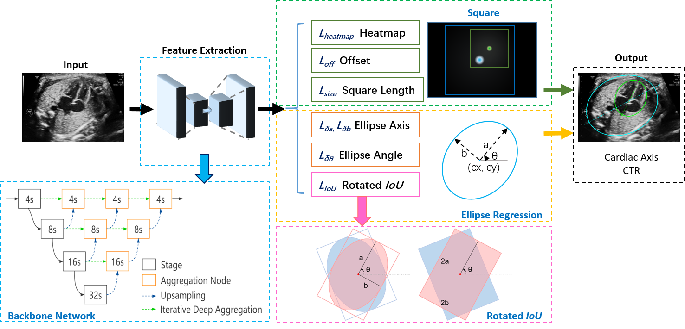

# EllipseNet: Anchor-Free Ellipse Detection for Automatic Cardiac Biometrics in Fetal Echocardiography (MICCAI-2021)
by Jiancong Chen, Yingying Zhang, Jingyi Wang, Xiaoxue Zhou, Yihua He, Tong Zhang. 

This repo contains the **official pytorch implemetation** for EllipseNet.

## Abstract 

As an important scan plane, four chamber view is routinely performed in both second trimester perinatal screening and fetal echocardiographic examinations. The biometrics in this plane including cardio-thoracic ratio (CTR) and cardiac axis are usually measured by sonographers for diagnosing congenital heart disease. However, due to the commonly existing artifacts like acoustic shadowing, the traditional manual measurements not only suffer from the low efficiency, but also with the inconsistent results depending on the operators' skills. In this paper, we present an anchor-free ellipse detection network, namely EllipseNet, which detects the cardiac and thoracic regions in ellipse and automatically calculates the CTR and cardiac axis for fetal cardiac biometrics in 4-chamber view. In particular, we formulate the network that detects the center of each object as points and regresses the ellipses' parameters simultaneously. We define an intersection-over-union loss to further regulate the regression procedure. We evaluate EllipseNet on clinical echocardiogram dataset with more than 2000 subjects. Experimental results show that the proposed framework outperforms several state-of-the-art methods.

## Main results

### Experimental Results

| Methods  |  Setting | DiceT |  DiceC  | Diceall | Pavg |
|----------|----------|----------|------------|---------------|-------------|
|EllipseNet (exp6) | only IoU loss | 0.8813 | 0.8520 | 0.8666 | 0.8855 |
|EllipseNet (exp1) | w/o IoU loss  | 0.9338 | 0.9108 | 0.9224 | 0.8841 |
|EllipseNet (exp3) | w/ IoU loss   | **0.9430** | **0.9224** | **0.9336** | **0.8949** |

## Installation

Please refer to [INSTALL.md](readme/INSTALL.md) for installation instructions.

## Use EllipseNet

Detection result will be a python dict: `{category_id : [[x1, y1, a, b, theta], ...], }`

## Benchmark Evaluation and Training

After [installation](readme/INSTALL.md), prepare the elliptical dataset in coco-format. An example script is given in [scripts](scripts)/prepare_label.ipynb.
We provide scripts for all the experiments in the [experiments](experiments) folder.

Usage:
~~~
chmod +x experiments/miccai21/*.sh
./experiments/miccai21/exp3_base_theta5_iou.sh
~~~

## License

EllipseNet itself is released under the MIT License (refer to the LICENSE file for details).
Portions of the code are borrowed from [CenterNet](https://github.com/xingyizhou/CenterNet), [Rotated_IoU](https://github.com/lilanxiao/Rotated_IoU), [human-pose-estimation.pytorch](https://github.com/Microsoft/human-pose-estimation.pytorch) (image transform, resnet), [CornerNet](https://github.com/princeton-vl/CornerNet) (hourglassnet, loss functions), [dla](https://github.com/ucbdrive/dla) (DLA network), [DCNv2](https://github.com/CharlesShang/DCNv2) (deformable convolutions), [tf-faster-rcnn](https://github.com/endernewton/tf-faster-rcnn) (Pascal VOC evaluation) and [kitti_eval](https://github.com/prclibo/kitti_eval) (KITTI dataset evaluation). Please refer to the original License of these projects (See [NOTICE](NOTICE)).

## Citation

If you find this project useful for your research, please use the following BibTeX entry.

    @TBD